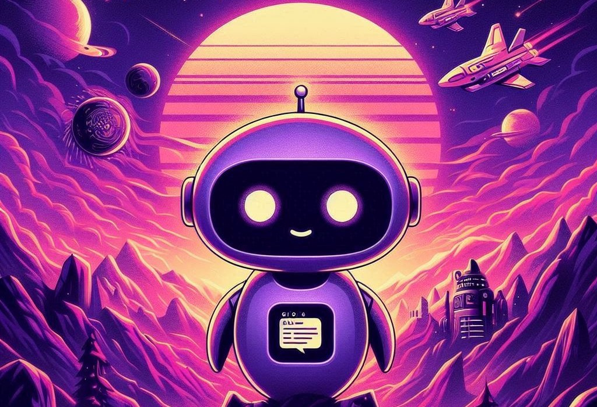
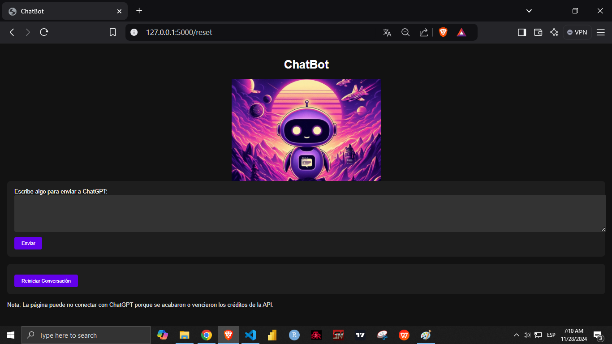
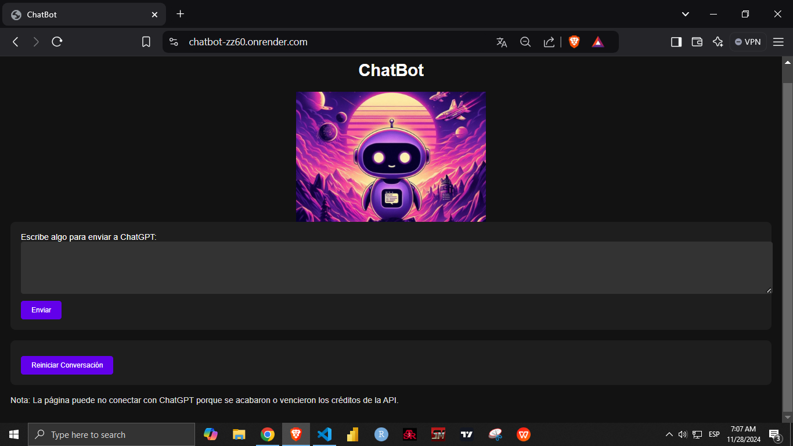

# ChatBot -> Flask - OpenAI - Render

<p align="center">

</p>

# Índice

* [Construcción del ChatBot](#Construcción-del-ChatBot) 
* [Página en Local](#Página-en-Local) 
* [Deploy en Render](#Deploy-en-Render) 
* [Requisitos](#Requisitos) 
* [Autor](#Autor)


# Construcción del ChatBot

Para la construcción del chatbot, se utilizó **GPT-3.5-Turbo**, un modelo de lenguaje avanzado proporcionado por OpenAI. La comunicación con ChatGPT se realiza mediante la **API de OpenAI**, que permite integrar funcionalidades de conversación basadas en IA en aplicaciones externas, como este chatbot web.

El flujo general de la construcción del chatbot es el siguiente:

## Configuración del Entorno de Desarrollo:
   - Se creó un entorno virtual de Python para instalar las dependencias necesarias, como Flask (framework de desarrollo web) y la biblioteca de OpenAI para interactuar con su API.
```python
#Pasos para la creación del entorno virtual
#Correr cmd dentro de la carpeta del proyecto

python -m venv venv             # Crea el entorno virtual
venv\Scripts\activate           # Activa el entorno virtual
pip install Flask               # y todas las dependencias necesarias
pip freeze > requirements.txt   # Guarda en un txt las librerías requeridas
deactivate                      # Desactiva el entorno virtual
```
   - La API Key de OpenAI se configura como una variable de entorno para asegurar la seguridad y evitar la exposición directa de la clave en el código. Esto permite que Flask pueda acceder a la API de OpenAI de manera segura. Para esto se creó un archivo .env con las credenciales de OpenAI.


## Integración con la API de OpenAI:
   - A través de la biblioteca `openai` para Python, el chatbot envía mensajes del usuario a la API de OpenAI y recibe las respuestas generadas por ChatGPT.
   - En el archivo [`app.py`](https://github.com/jrguignan/ChatBot/blob/main/app.py), se configuran los parámetros necesarios para la comunicación con OpenAI, como el modelo a utilizar (por ejemplo, `gpt-3.5-turbo`), y la función de generación de mensajes de respuesta del chatbot en base al input del usuario.
   - Para más detalles sobre la biblioteca de OpenAI, visita su [repositorio oficial](https://github.com/openai/openai-python).

## Creación de la Interfaz del Chat:
   - La interfaz de usuario está construida con HTML y CSS en el archivo [`index.html`](https://github.com/jrguignan/ChatBot/blob/main/templates/index.html), ubicado en la carpeta `templates`. Este archivo permite que el usuario pueda interactuar con el chatbot ingresando mensajes y visualizando las respuestas en tiempo real.
   - A través de JavaScript, los mensajes del usuario se envían al backend de Flask mediante una solicitud `POST`. Al recibir la respuesta de la API de OpenAI, el backend la envía de regreso y se muestra en la interfaz.
   
## Diseño del Flujo de Conversación:
   - La interfaz visual del chatbot sigue un estilo intuitivo, permitiendo que los mensajes del usuario y las respuestas del chatbot se diferencien claramente. Cada mensaje tiene un estilo distinto según su remitente (usuario o chatbot), mejorando así la experiencia visual y de interacción del usuario.

## Control de Errores y Respuesta del Chatbot:
   - Se incluye un manejo de excepciones en el archivo `app.py` para gestionar posibles errores en la comunicación con la API (por ejemplo, fallos de conexión o errores de autenticación). En caso de error, se envía un mensaje amigable de advertencia al usuario.

Este flujo de construcción permite que el chatbot funcione de manera eficaz y segura, garantizando una comunicación fluida con el modelo de lenguaje de OpenAI para generar respuestas relevantes y coherentes.

---

<br>[Volver al Índice](#Índice)

# Página en Local

```python
#Para correr en local la página en Flask

#Clona este repositorio en tu equipo:
git clone https://github.com/jrguignan/ChatBot.git

#Entrar dentro del directorio
cd ChatBot

#Ejecutar app.py para ver la página en local
python app.py

#Luego se puede ver un navegador en esta dirección: http://127.0.0.1:5000
```
<p align="center">

</p>

# Deploy en Render

Se siguieron los pasos sugeridos por render en la creacion de un sitio web, sólo se tomaron en cuentas las siguentes pautas para hacer el deploy:

pip install -r requirements.txt

gunicorn --bind 0.0.0.0:5000 app:app

Environment Variables -> Se cargó en render el archivo .env

[Link ChatBot en Render](https://chatbot-zz60.onrender.com/)

<p align="center">

</p>

# Requisitos

Se encuentra en el archivo [requirements.txt](https://github.com/jrguignan/ChatBot/blob/main/requirements.txt)

Estos son las librerías principales:

- Python==3.11.5: Necesario para ejecutar Flask y las dependencias de la API. Proporciona la base del entorno de ejecución.

- Flask==3.0.3: Framework web ligero y fácil de usar para Python, que permite desarrollar aplicaciones web rápidamente y con flexibilidad.

- openai==1.52.2: Biblioteca para interactuar con la API de OpenAI. Asegúrate de configurar tu clave de API en las variables de entorno para que el chatbot pueda comunicarse con el modelo de lenguaje de OpenAI.

- Jinja2==3.1.4: Motor de plantillas para Python que permite a los desarrolladores generar HTML dinámico con simplicidad y elegancia.

- jiter==0.8.0: Biblioteca para ejecutar pruebas y automatizaciones en diversas aplicaciones, permitiendo una mayor eficiencia en el desarrollo y despliegue.

- gunicorn==23.0.0: Servidor WSGI para aplicaciones web Python, diseñado para manejar múltiples solicitudes de manera eficiente y con alto rendimiento. Ideal para el despliegue de aplicaciones en producción.

<br>[Volver al Índice](#Índice)

# Autor

José R. Guignan
- Mail: joserguignan@gmail.com
- Linkedin: [https://www.linkedin.com/in/jrguignan/](https://www.linkedin.com/in/jrguignan)
- Portafolio: [https://jrguignan.github.io/](https://jrguignan.github.io/)
